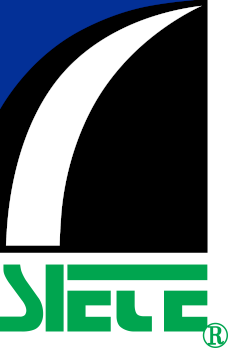
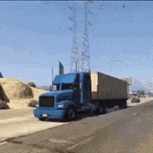

  
  <h1 style="text-align: right; font-size: 30px; font-weight: bold; color: black; margin: 0;">
    Servicio Internacional De Enlace Terrestre
  </h1>

## Descripcion
Esta organización fue creada con el objetivo de centralizar todos los proyectos desarrollados hasta la fecha y facilitar el control de versiones y el almacenamiento seguro de los mismos, utilizando la herramienta GitHub. 

  

